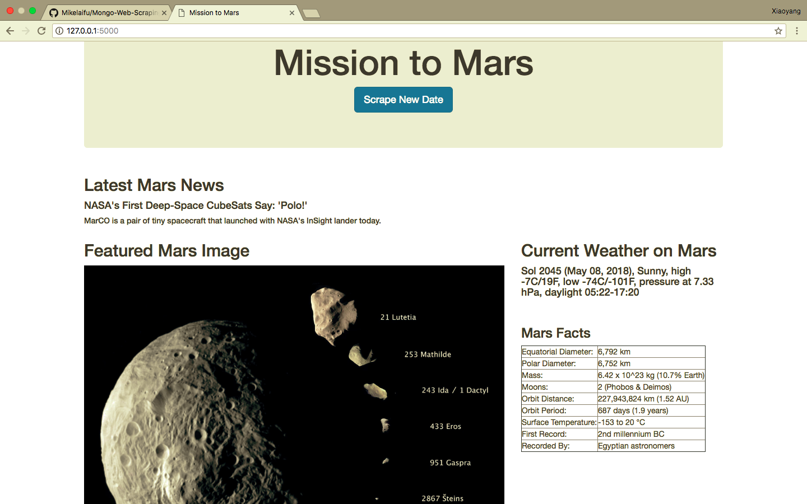
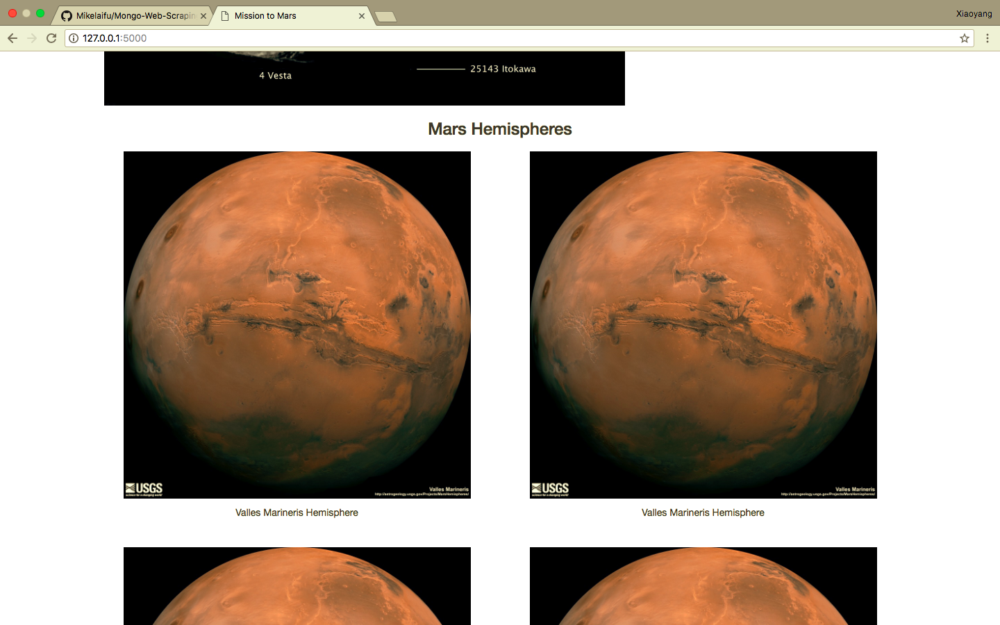

# Mission to Mars

Final Visual: 

### In this Project, I will build a web application that scrapes various websites for data related to the Mission to Mars and displays the information in a single HTML page. The following outlines what you need to do.

## Step 1 - Scraping data Rescourses

Complete your initial scraping using Jupyter Notebook, BeautifulSoup, Pandas, and Requests/Splinter.

* Create a Jupyter Notebook file called `mission_to_mars.ipynb` and use this to complete all of your scraping and analysis tasks. The following outlines what you need to scrape.

### NASA Mars News

* Scrape the [NASA Mars News Site](https://mars.nasa.gov/news/) and collect the latest News Title and Paragragh Text. Assign the text to variables that you can reference later.

### JPL Mars Space Images - Featured Image

* Visit the url for JPL's Featured Space Image [here](https://www.jpl.nasa.gov/spaceimages/?search=&category=Mars).

* Use splinter to navigate the site and find the image url for the current Featured Mars Image and assign the url string to a variable called `featured_image_url`.

* Make sure to find the image url to the full size `.jpg` image.

* Make sure to save a complete url string for this image.

### Mars Weather

* Visit the Mars Weather twitter account [here](https://twitter.com/marswxreport?lang=en) and scrape the latest Mars weather tweet from the page. Save the tweet text for the weather report as a variable called `mars_weather`.

### Mars Facts

* Visit the Mars Facts webpage [here](http://space-facts.com/mars/) and use Pandas to scrape the table containing facts about the planet including Diameter, Mass, etc.

* Use Pandas to convert the data to a HTML table string.

### Mars Hemisperes

* Visit the USGS Astrogeology site [here](https://astrogeology.usgs.gov/search/results?q=hemisphere+enhanced&k1=target&v1=Mars) to obtain high resolution images for each of Mar's hemispheres.

* You will need to click each of the links to the hemispheres in order to find the image url to the full resolution image.

* Save both the image url string for the full resolution hemipshere image, and the Hemisphere title containing the hemisphere name. Use a Python dictionary to store the data using the keys `img_url` and `title`.

* Append the dictionary with the image url string and the hemisphere title to a list. This list will contain one dictionary for each hemisphere.

---

## Step 2 - MongoDB and Flask Application

Use MongoDB with Flask templating to create a new HTML page that displays all of the information that was scraped from the URLs above.

